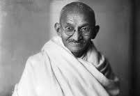

# Mahatma Gandhi Biography

## Description

This HTML document provides a brief biography of Mahatma Gandhi, the leader of the Indian nationalist movement against British rule. It includes information about his birthdate, a portrait image, and a summary of his life and achievements.

## Biography

### Name: Mahatma Gandhi
### Birthdate: October 2, 1869
### Place of Birth: Porbandar, India
### Date of Death: January 30, 1948
### Place of Death: Delhi, India

Mahatma Gandhi, byname of Mohandas Karamchand Gandhi, was an Indian lawyer, politician, social activist, and writer. He is internationally esteemed for his doctrine of nonviolent protest (satyagraha) to achieve political and social progress. Gandhi became the leader of the nationalist movement against British rule of India and is considered the father of his country.

## Design

### Styling
- **Background Color**: Light grey
- **Font Color**: Black
- **Font Family**: Times New Roman

### Image
- **Image**: 
- **Caption**: Mahatma Gandhi

## Files

- `tribute.html`: Contains the HTML structure of the web application.
- `CSS.css`: Contains the CSS styles for styling the web application.

  ## Requirements

- Any text editor
- any browser with iternet connectivity

